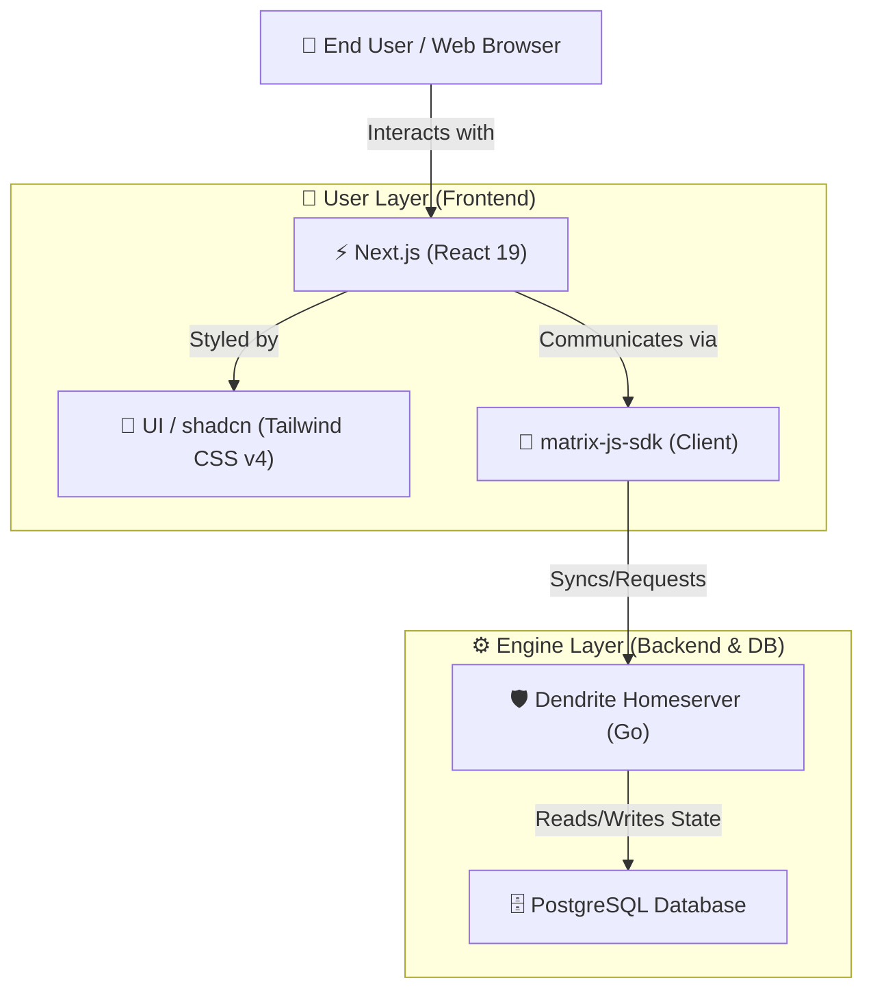

# 🗺️ Project Architecture & Tech Stack

This document details the core components powering the Messaging App, its surrounding infrastructure, and the roadmap for implementation.

---

## 🧭 System Topology

The diagram below shows how the user interacts with the Next.js client, how the Matrix SDK initiates real-time synchronization, and how the Dendrite server persists state in PostgreSQL.

---

## 📊 Stack Breakdown

| Layer | Technology | Primary Role | Core Functionality |
| :--- | :--- | :--- | :--- |
| **User Layer** | [Next.js 15+](https://nextjs.org/) | App Framework | Server-side rendering (SSR), app routing, and static page loading. |
| **User Layer** | [shadcn/ui](https://ui.shadcn.com/) | Styling Engine | Pre-built Tailwind CSS components for premium, responsive UI styling. |
| **User Layer** | [`matrix-js-sdk`](https://github.com/matrix-org/matrix-js-sdk) | Client SDK | Managing the room sync loop, user sessions, and message transactions. |
| **Engine Layer** | [Dendrite](https://github.com/matrix-org/dendrite) | Matrix Server | Processing room requests, E2E encryption, and server-to-server federation. |
| **Engine Layer** | [PostgreSQL](https://www.postgresql.org/) | Database Storage | Storing credentials, room state logs, and event log metadata. |

---

## 🔍 Detailed Component Directory

### 🎨 Frontend & Interface (The User Layer)

*   **Next.js**: Serves the Chat Client and administrative dashboard. It optimizes package loading and guarantees fast client load times.
*   **matrix-js-sdk**: A library that maintains a persistent connection with Dendrite homeservers to immediately push new messages to the active chat screen.
*   **shadcn/ui**: Out-of-the-box styled components that adapt cleanly to light/dark workspaces.

### ⚙️ Core Infrastructure (The Engine)

*   **Dendrite**: Written in Go, this next-generation homeserver delivers performance optimizations, modular microservices, and clean API endpoints.
*   **PostgreSQL**: Handles heavy transaction loads and secures message history logs, allowing flexible scaling of chat channels.

---

## 🚀 Implementation Phases

### 🛠️ Phase 1: Infrastructure & Core Server

The foundation is your Dendrite homeserver. Since you are using the ELK stack, you need to ensure logs are structured.

*   **Deploy Dendrite**: Use Docker for a consistent environment. Configure it with PostgreSQL (required for production).
*   **Identity & Keys**: Generate your server signing keys and set up your Matrix domain (`https://im.tibcert.org`). Set up Nginx Proxy Manager and Grafana for dashboards.
*   **Logging**: Implement structured logging with Prometheus and Grafana.

### 💻 Phase 2: Next.js Chat Client

Build the actual interface users will see.

*   **SDK Setup**: Install `matrix-js-sdk` in your Next.js project. This handles the Matrix protocol so we don't have to write raw API calls.
*   **Core Logic (Client-Server actions)**:
    *   **Auth**: Login and Register screens.
    *   **The Sync Loop**: The most critical part; this keeps the chat updating in real-time without refreshing.
*   **UI/UX**: Use shadcn/ui (Tailwind CSS) for a responsive chat layout (Sidebar for rooms, Main area for messages).
*   **Deployment**: Deploy to Vercel, Netlify, or Cloudflare for easy CI/CD and edge performance.
